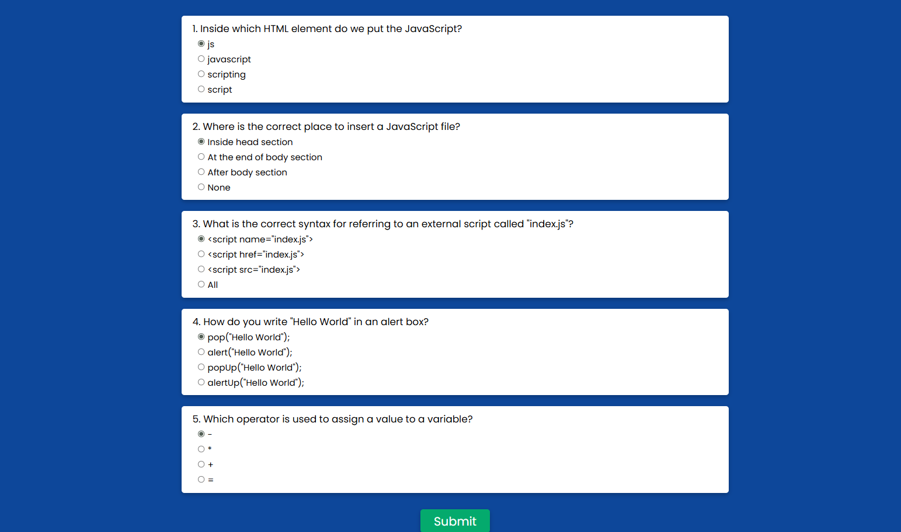
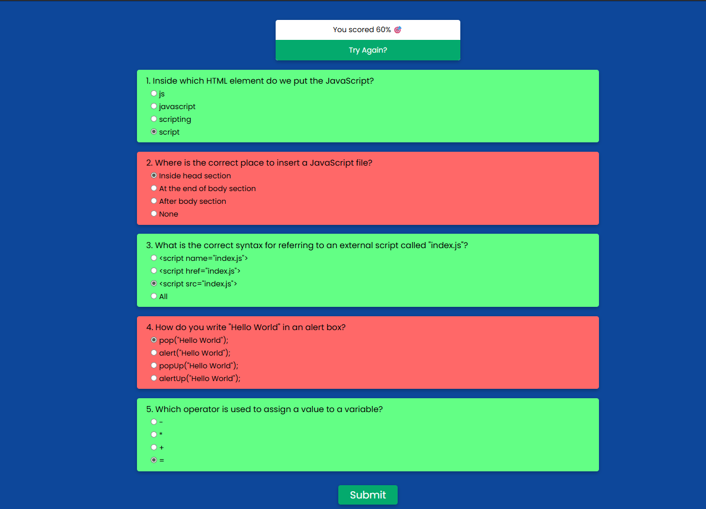

# 📚 JavaScript Quiz App

A simple and interactive **JavaScript Quiz Application** built using HTML, CSS and JavaScript.
It displays multiple-choice questions, calculates the score and highlights correct/wrong answers.

---

## 🚀 Live Demo

## [Click here to try the live quiz](https://urjiiko1.github.io/code-craft/Project%20Assignement/QuizApp)

---

## 📸 Screenshots

### Quiz Page


### Result Page


---

## ✨ Features
- 🖱 Multiple-choice questions
- ✅ Instant result calculation
- 🎯 Highlights correct and wrong answers
- 🔄 Option to retake the quiz
- 📱 Fully responsive design

---

## 🛠 Tech Stack
- **HTML5** – Structure
- **CSS3** – Styling & Layout
- **JavaScript (ES6)** – Functionality

---

## 📂 Project Structure
```
📦 quiz-app
┣ 📂 screenshot
┃ ┣ 📜 quiz.png
┃ ┗ 📜 result.png
┣ 📜 index.html
┣ 📜 style.css
┣ 📜 app.js
┗ 📜 README.md
```

---

## ⚙️ Installation & Usage

1. **Clone the repository**
   ```bash
   git clone [https://github.com/](https://github.com/)[urjiiko1]/quiz-app.git

 

2.  **Navigate to the project folder**
    ```bash
    cd quiz-app
    ```
3.  **Open `index.html` in your browser**
    Or use Live Server in VS Code for a hot reload.

---

## 📋 How It Works

The user selects answers to multiple-choice questions. When submitted, the app:

* Compares each selected answer with the correct one.
* Calculates the total score.
* Highlights correct answers in green and wrong answers in red.
* Displays the score and provides a "Try Again" option.

---

## 🖌 Customization

* Add or change questions in `index.html` under the `.question` blocks.
* Update the correct answers array in `app.js`:
    ```javascript
    const correctAnswers = ['D', 'B', 'C', 'B', 'D'];
    ```
* Modify colors or styles in `style.css`.

---

## 💡 Author

Created with ❤️  **[Gemachis]**
[GitHub Profile](https://github.com/urjiiko1)