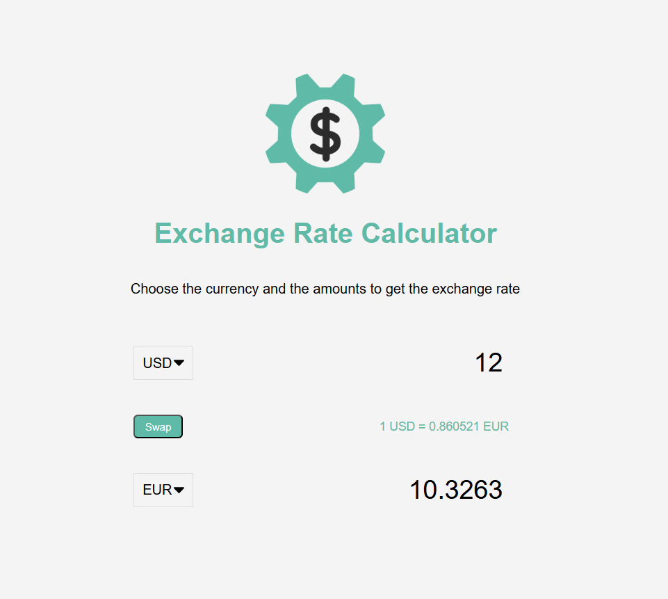

# 💱 Exchange Rate Calculator

A simple, **live** exchange rate calculator that:  
- 🌍 Lets you pick **two currencies**  
- 🔄 Enter an amount in **either side** (bi-directional)  
- 📊 Shows **current rate** and **converted value**  
- 🔃 Supports **swapping currencies**  
- ⚡ Caches recent rates for faster loads  

💡 Rates come from: `https://api.exchangerate-api.com/v4/latest/{BASE}` (free endpoint)

---

## [🌟 View Project Live Here](https://urjiiko1.github.io/code-craft/Project%20Assignement/exchange-rate)

---

## 📸 Screenshot

---

## 📂 Files
- `index.html` — 📜 App markup  
- `style.css` — 🎨 Styles  
- `script.js` — 🧠 Logic & API calls  

---

## 🖥 Run Locally
1. 📁 Put all files in a folder.  
2. 🌐 Open `index.html` in your browser (**no server required**).  
3. 📡 The app fetches **live rates**; no API key needed.  

---

## 🚀 Deploy to GitHub Pages
1. 🛠 Create a repo and **push these files**.  
2. ⚙ Go to **Settings → Pages**, select `main` branch and `/ (root)`.  
3. ⏳ Wait a minute and open the **published URL**.  

---

## 📝 Notes
- ⏱ **Caching:** Rates for a base currency are cached for 10 minutes to reduce API calls.  
- ⌛ **Debounce:** Typing waits ~250ms before triggering conversion.  
- 🚫 **Error Handling:** If API fails, an error message will appear.  

---

💬 Want more?
- ➕ Add more currencies to the `<select>` lists   
- 🕒 Display **last-updated** timestamp 

` 📩 Just ask and I’ll add it! ` 

---

## 💡 Author

Created with ❤️  **[Gemachis]**
[GitHub Profile](https://github.com/urjiiko1)
