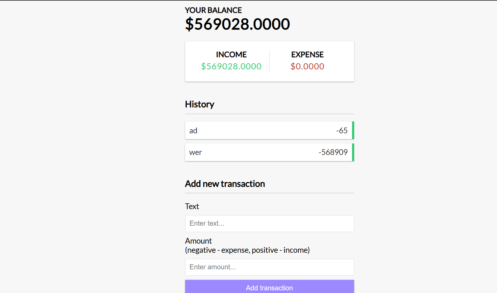

# 💰 Expense Tracker

A simple Expense Tracker app that lets you:
- Add income & expense transactions
- View total balance, income and expenses
- Delete transactions
- Data persists using **Local Storage**

---

## 🚀 View Project Live Here

[Click to try the live app](https://urjiiko1.github.io/code-craft/Project%20Assignement/expense-tracker)

---

## 📸 Screenshot



---

## 📦 Features

- **Add Transactions** — Positive values are income, negative are expenses.
- **Delete Transactions** — Remove any entry from the list instantly.
- **Local Storage** — Your data is saved even after you refresh the page.
- **Responsive UI** — The app looks great on both desktop and mobile devices.

---

## 🛠️ Tech Stack

- **HTML5** – Structure
- **CSS3** – Styling & Layout
- **JavaScript (Vanilla)** – Functionality
- **Local Storage API** – Data persistence

---

## ⚙️ Project Setup

1.  **Clone the repository**
    ```bash
    git clone [https://github.com/urjiiko1/code-craft.git](https://github.com/urjiiko1/code-craft.git)
    ```
2.  **Navigate to the project folder**
    ```bash
    cd code-craft/Project\ Assignement/expense-tracker
    ```
3.  **Open `index.html` in your browser**
    You can also use the Live Server extension in VS Code for a hot reload.

---

## 🤝 How to Contribute 🛠️

We welcome contributions! If you'd like to help improve this project, please follow these steps:

1.  **Fork** the repository.
2.  Create a new branch: `git checkout -b feature/your-feature-name`.
3.  Make your changes and **commit** them: `git commit -m 'Add a new feature'`.
4.  Push to the branch: `git push origin feature/your-feature-name`.
5.  Open a **Pull Request** and describe your changes.

---

## 💡 Author

Created with ❤️  **[Gemachis]**
[GitHub Profile](https://github.com/urjiiko1)