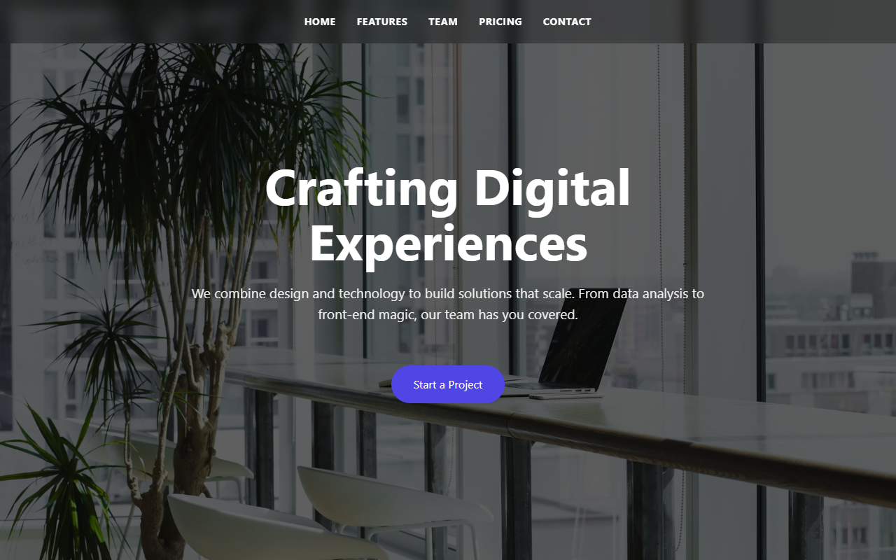
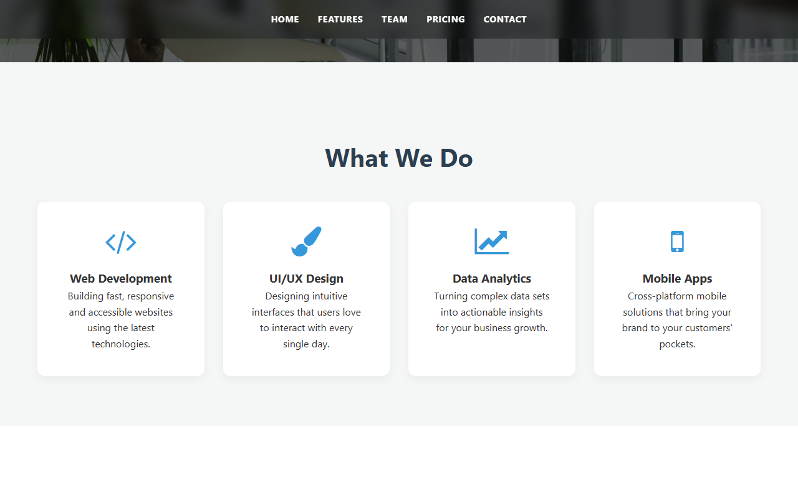

# 🎨 CSS Practice

A modern creative agency landing page showcasing clean layouts, advanced CSS techniques and responsive design.

---

## 🚀 Live Demo

👉 **[View Live Demo](https://gemachistesfaye.github.io/Summer-Bootcamp-Projects/css-layout-exercises/)**

---

## 📸 Screenshots

| Hero | Features |
|------|----------|
|  |  |

---

## ✨ Features

- Full-width responsive hero section with CTA
- Service cards for Web Development, UI/UX, Data Analytics and Mobile Apps
- Team profile cards with social icons and hover effects
- Tiered pricing table with highlighted popular option
- Clean contact form

---

## 🛠️ Tech Stack

| Technology | Purpose |
|------------|----------|
| **HTML5** | Semantic structure |
| **CSS3** | Flexbox, Grid, animations |
| **Font Awesome** | Icons |
| **Unsplash Images** | Visuals |

---

## 📂 Project Structure

```
css-layout-exercises/
├── image/
├── index.html
├── style.css
└── README.md
```

---

## 👤 Author

**Gemachis Tesfaye** — [GitHub](https://github.com/gemachistesfaye)
